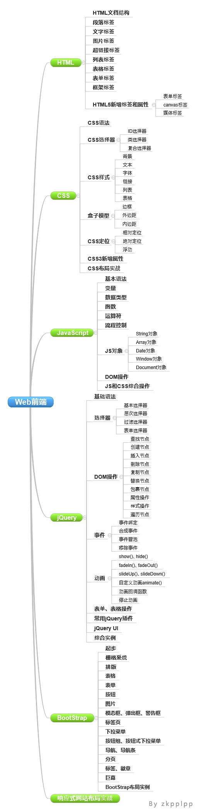
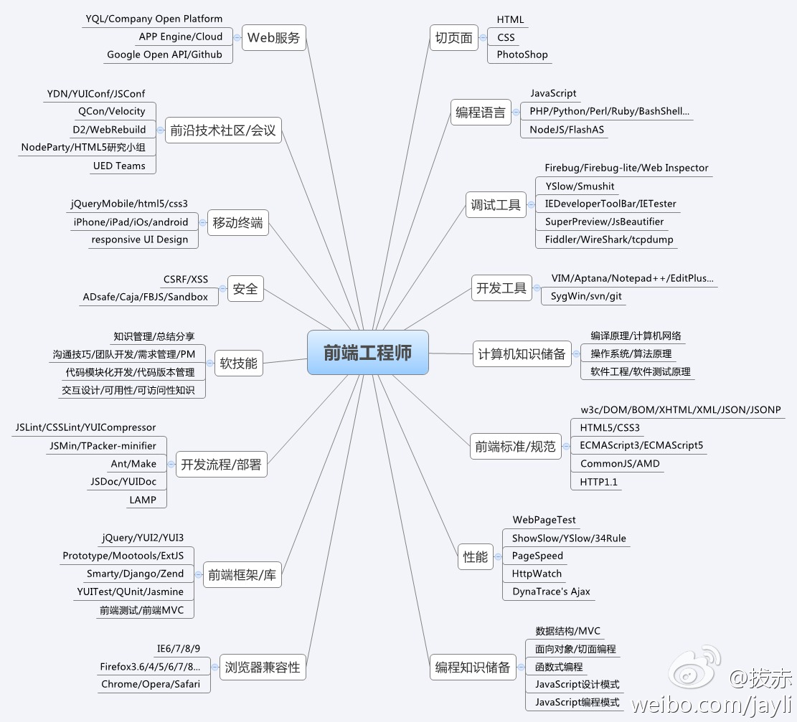
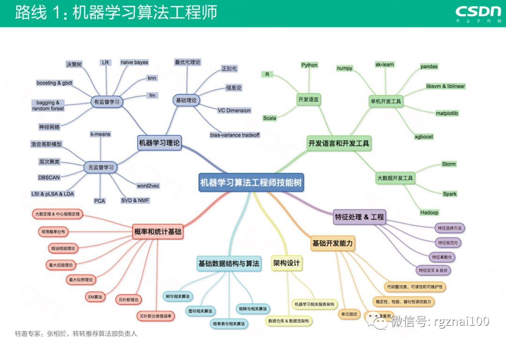
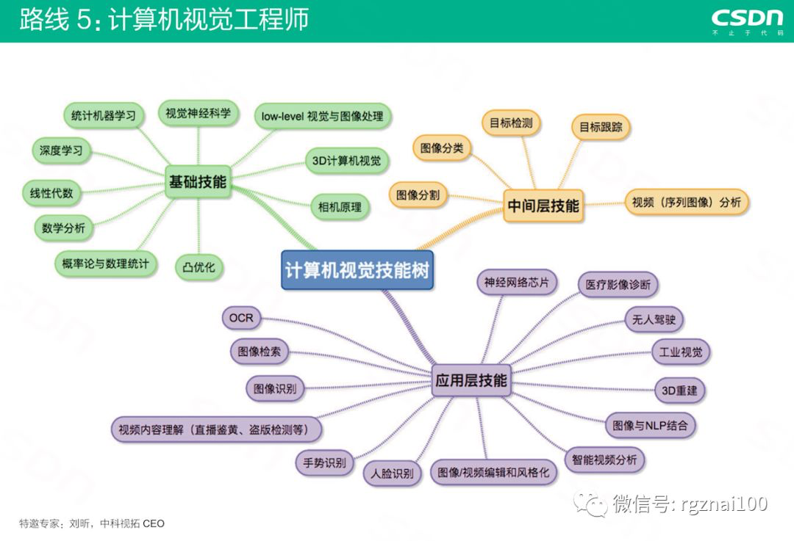
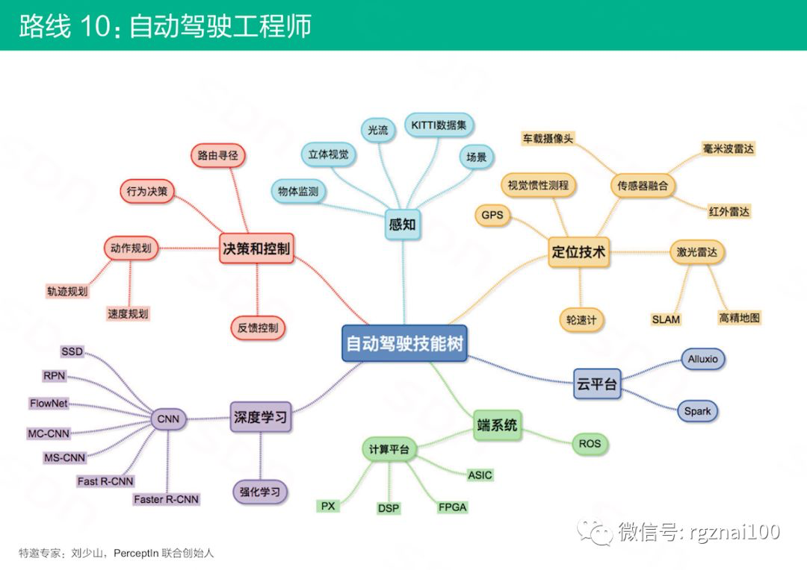

# 知识技能图谱

在学习不同领域的技术时，往往会发现，不同领域所需要学习的内容和方向差距还是很大的，感觉算是**隔行如隔山**，换个技术领域和方向，很多名词甚至都没听说过。

另外，在某个领域有了深入专研之后，往往可以总结出很多该领域相关的技术和名词，整理出成系统的内容，往往就叫做该领域的**技术图谱**，**知识图谱**，**技能树**，**技术成长路线图**。

## TeamStuQ/skill-map: 程序员技能图谱
这个**[TeamStuQ/skill-map: 程序员技能图谱](https://github.com/TeamStuQ/skill-map)**中已经整理了**几十个领域**的技能图谱了，此处就不再做重复劳动，请移步去看即可。

此处把其他一些人制作的的图谱整理如下，供参考：

## 前端开发 知识图谱
[QzhouZ/Front-End-Study: 前端开发基础知识学习](https://github.com/QzhouZ/Front-End-Study)

[JacksonTian/fks: 前端技能汇总 Frontend Knowledge Structure]https://github.com/JacksonTian/fks

## 机器学习算法工程师

## 计算机视觉工程师

## 自动驾驶工程师

