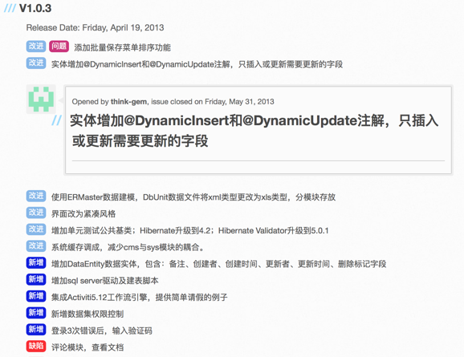

# 版本号命名和版本发布

## 版本号命名规范
比如每次发版本的app，如果只是小功能更新，则只是第二位加1（或根据功能数量决定），否则大的版本的改进，则是第一位加1

[Configuration · GitBook Toolchain Documentation](https://toolchain.gitbook.com/config.html#structure)

是有个官网推荐的做法的：

[Semantic Versioning 2.0.0 | Semantic Versioning](https://semver.org)

其解释是：

> Given a version number MAJOR.MINOR.PATCH, increment the:
> * `MAJOR version`: when you make incompatible API changes,
> * `MINOR version`: when you add functionality in a backwards-compatible manner, and
> * `PATCH version`: when you make backwards-compatible bug fixes.

Additional labels for pre-release and build metadata are available as extensions to the MAJOR.MINOR.PATCH format.

中文版翻译是：

[语义化版本 2.0.0](http://semver.org/lang/zh-CN/)

> 版本格式：主版本号.次版本号.修订号，版本号递增规则如下：
> 
> 1. 主版本号：当你做了不兼容的 API 修改，
> 2. 次版本号：当你做了向下兼容的功能性新增，
> 3. 修订号：当你做了向下兼容的问题修正。
> 
> 先行版本号及版本编译信息可以加到“主版本号.次版本号.修订号”的后面，作为延伸。

现在个人的常见做法是：
1. `主版本`：有重大功能更新
  * 比如多加了一个大的功能模块
2. `次版本`：有一些重要更新
  * 比如部分功能有重大优化
3. `补丁版本/小版本`：细节的优化
  * 比如一些小功能的优化，修复了一些小bug等等

## 版本发布的一些实践和做法

对于发布新版本，去写更新日志时，其形式可以借鉴[jeesite](http://jeesite.com)的做法：

其效果很醒目，且点击每条可以展开显示详情

但是建议关键字还是用个人目前常用的做法：
* `新增`：增加了新功能
* `修复`：修复了之前存在的bug和问题
* `优化`：改进，优化了已有的东西
