# `Cheat Sheet`和`Handout`

## `Cheat sheet`的含义
软件领域内的

Cheat sheet和handout的解释

－》Cheat，中文含义为：作弊，Sheet：中文含义为：表格，表单，小纸片

－》cheat sheet，中文含义为：（用于作弊）小抄

－》放在软件行业内，意思是：

就像考试作弊一样，把大量的内容，精简的，有机的排列在一张纸，一张图上

特点：
* 化繁为简

用途：
* 方便随时参考和查阅
* 尤其常见于，把各种软件，工具等的快捷键，主要功能等，总结后列在一张图片内，多数以图文并茂的表格，图表，图片等形式展现

概述：
* 某某（语言，工具等）的Cheat sheet ＝＝ 某某（语言，工具等）快速查阅的图表型的手册

## `handout`的含义
另外的`handout`，中文本意：讲义；宣传册子，宣传品

－》往往有时候也可以认为：

`cheat sheet` == `handout`

Cheat sheet和handout的举例：

## `Cheat sheet`举例

### vi的cheat sheet
[VI Editor / Linux Terminal Cheat Sheet (PDF) – Smashing Magazine](https://www.smashingmagazine.com/2010/05/vi-editor-linux-terminal-cheat-sheet-pdf/)

－》

[VI-Help-Sheet-01-large2.jpg](https://media-mediatemple.netdna-ssl.com/wp-content/uploads/2010/05/VI-Help-Sheet-01-large2.jpg)

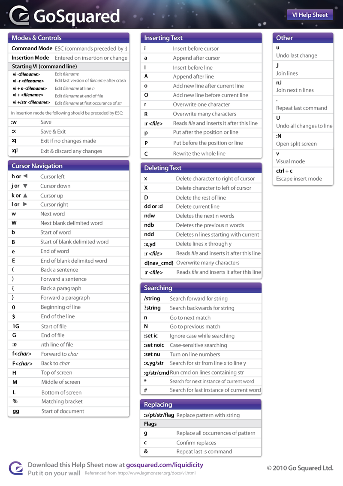

### Xcode的快捷键的cheat sheet

`http://www.crifan.com/xcode_common_used_keyboard_shortcut`

中的：

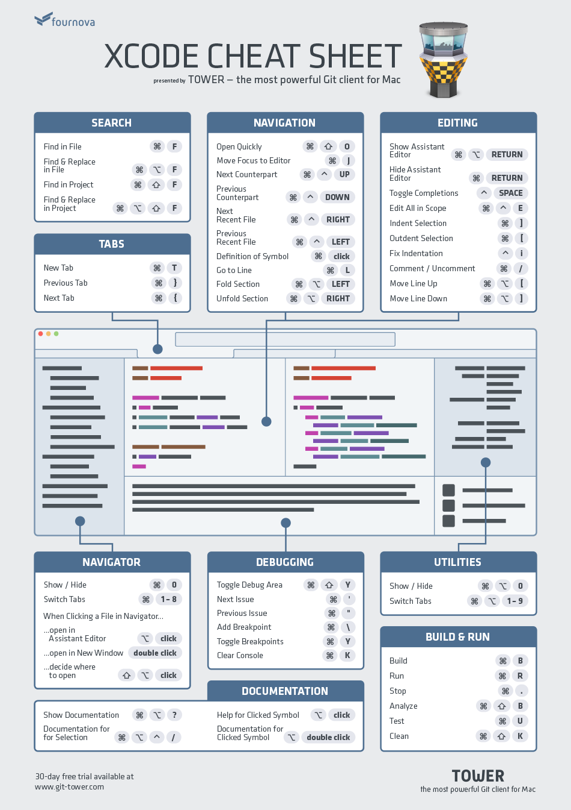

### python的cheat sheet

[python-cheat-sheet-v1.pdf](http://web.stanford.edu/class/physics91SI/handouts/python-cheat-sheet-v1.pdf)

[Python_qr.pdf](http://www.astro.up.pt/~sousasag/Python_For_Astronomers/Python_qr.pdf)

[python:cours:mementopython3-english.pdf](https://perso.limsi.fr/pointal/_media/python:cours:mementopython3-english.pdf)

[Keep This Python Cheat Sheet on Hand When Learning to Code](http://lifehacker.com/keep-this-python-cheat-sheet-on-hand-when-learning-to-c-1655521825)

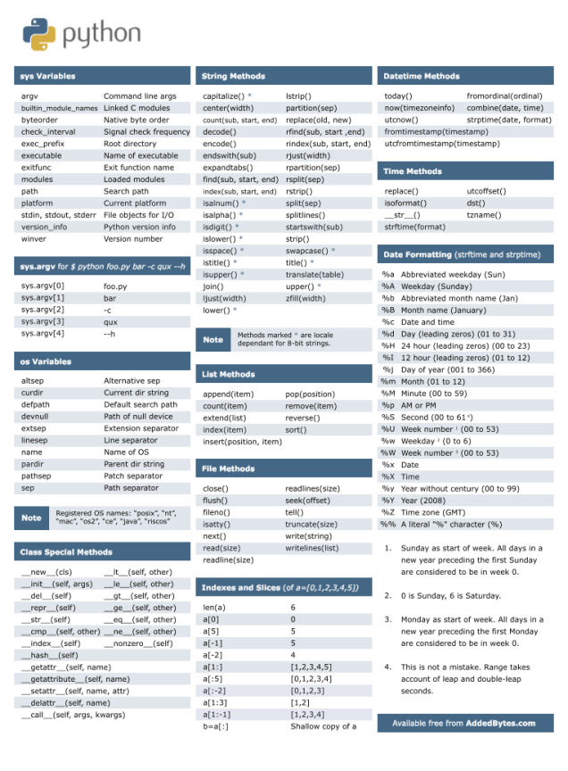

### go语言的cheat sheet

[go-lang-cheat-sheet](https://github.com/a8m/go-lang-cheat-sheet/blob/master/golang_refcard.pdf)

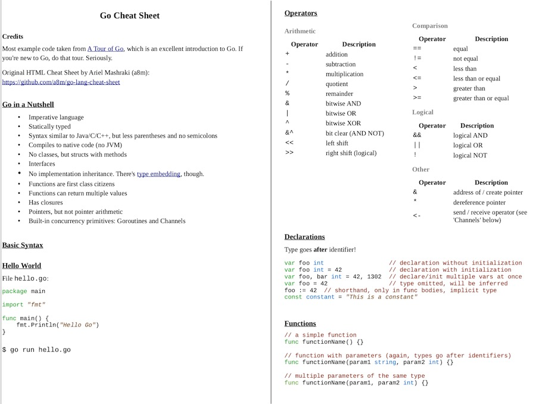
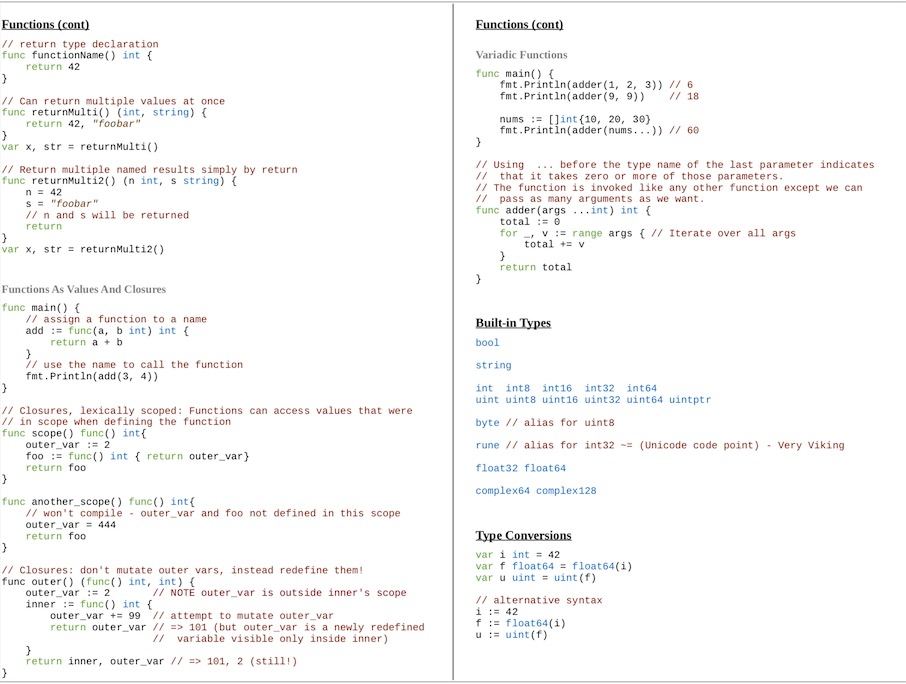
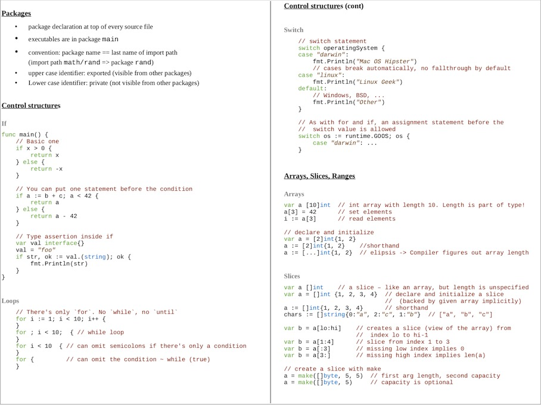
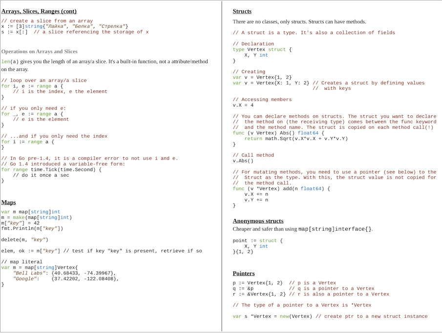
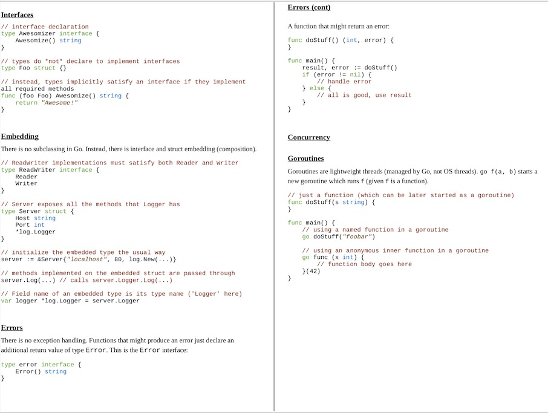
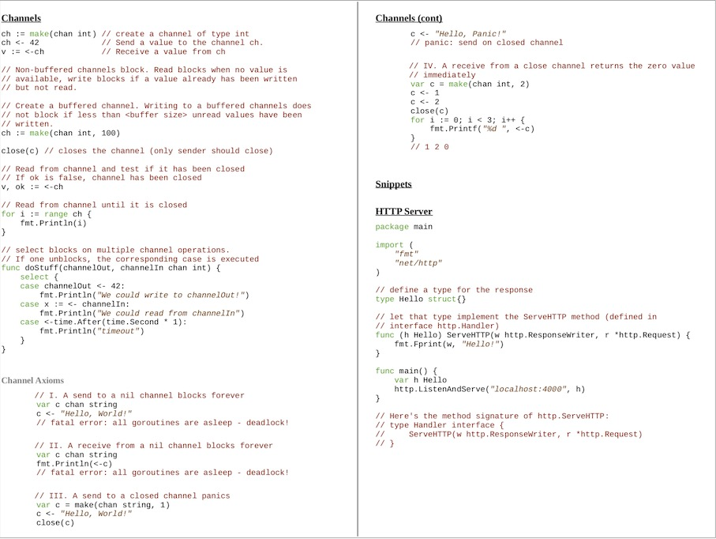

### HTML的cheat sheet

[htmlcheatsheet.pdf](http://web.stanford.edu/group/csp/cs21/htmlcheatsheet.pdf)

[HTML Cheat Sheet - A Simple Guide to HTML](http://www.simplehtmlguide.com/cheatsheet.php)

[HTML5 Cheat Sheet - WebsiteSetup.org](http://makeawebsitehub.com/the-html-5-mega-cheat-sheet/)

[HTML5 Cheat Sheet - WebsiteSetup.org](http://websitesetup.org/html5-cheat-sheet/)

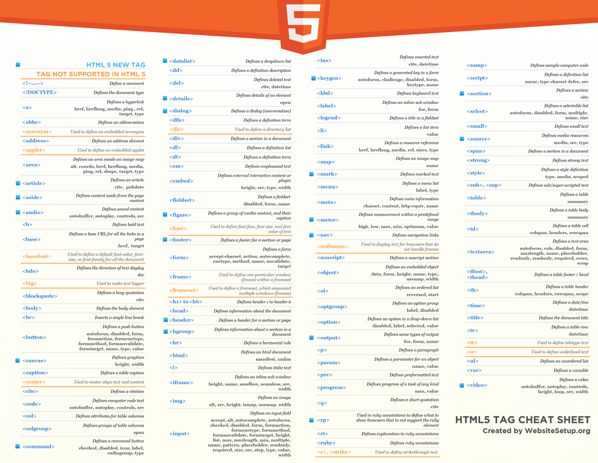

### Font Awesome 的Cheatsheet

React Native折腾期间，需要利用到对应字体：[‎fortawesome.github.io/Font-Awesome/icons/](http://fortawesome.github.io/Font-Awesome/icons/)

-》

[Font Awesome Cheatsheet](http://fontawesome.io/cheatsheet/)

就列出了所有的字体图标

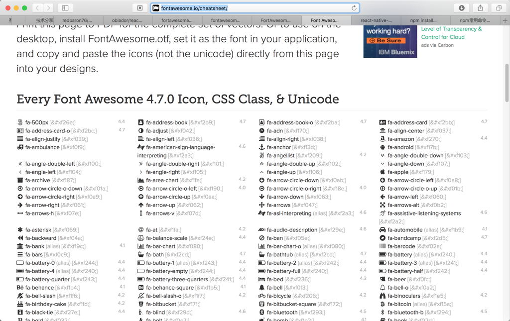

### React 的cheat sheet

[React Cheat Sheet](https://ihatetomatoes.net/wp-content/uploads/2017/01/react-cheat-sheet-v1.pdf)

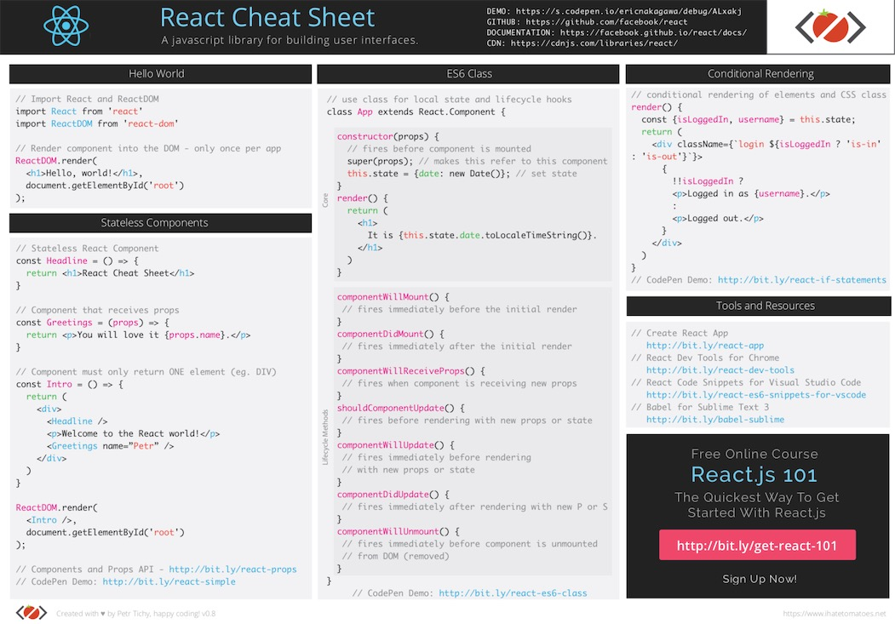

### Emoji的cheat sheet

[Emoji cheat sheet for GitHub, Basecamp and other services](https://www.webpagefx.com/tools/emoji-cheat-sheet/)

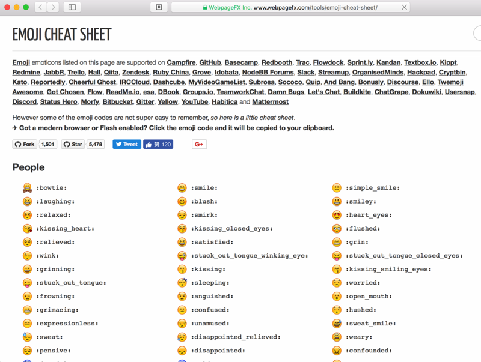

### Python的Pandas的cheatsheet

[Pandas Cheat Sheet for Data Science in Python (article) - DataCamp](https://www.datacamp.com/community/blog/python-pandas-cheat-sheet)

-》

[PandasPythonForDataScience.pdf](https://s3.amazonaws.com/assets.datacamp.com/blog_assets/PandasPythonForDataScience.pdf)

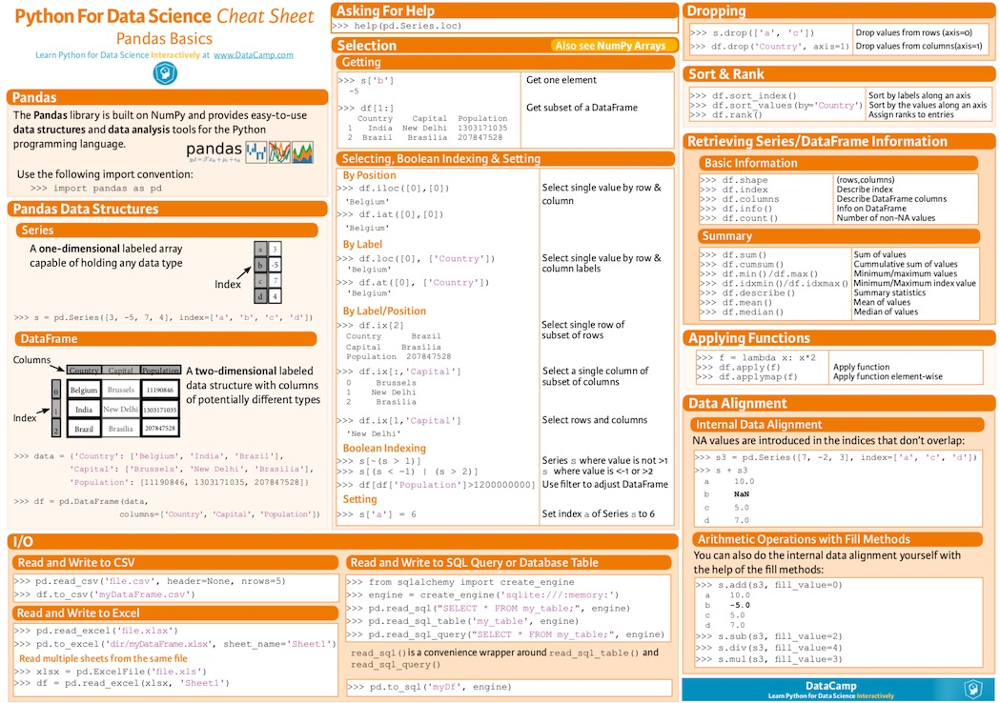

### Kotlin的cheatsheet

[Kotlin 作为 Android 开发语言相比传统 Java 有什么优势？ - 知乎](https://www.zhihu.com/question/37288009)

[Kotlin Programming Language Cheat Sheet Part 1](https://gist.github.com/dodyg/5823184)

[Kotlin Programming Language Cheat Sheet Part 2](https://gist.github.com/dodyg/5616605)

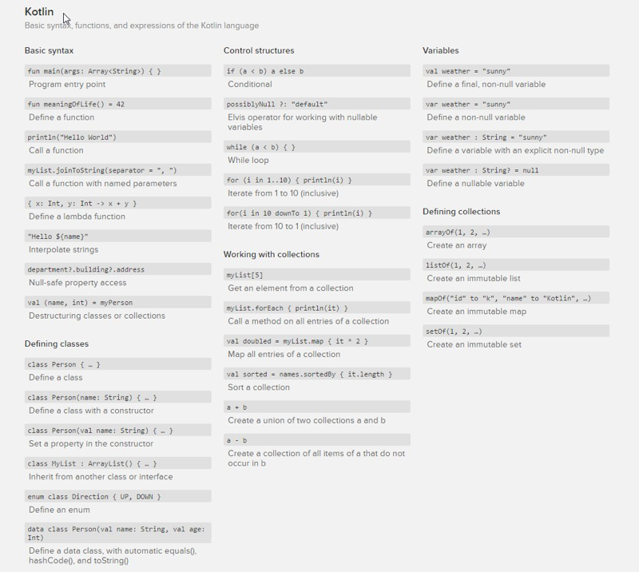

